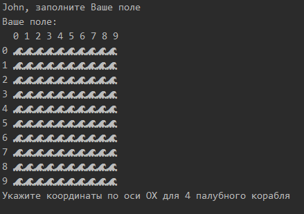
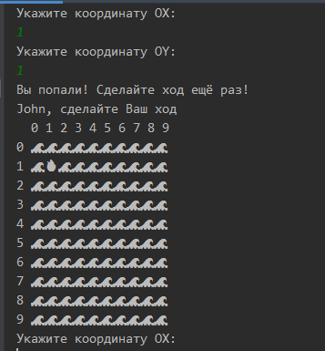

# Battleship

## Добрый день. Меня зовут Дамир, я начинающий Java разработчик
Программа была написана исходя
из задания по хакатону.
В игре два пользователя, каждый из 
них расставляет свои корабли:

После расстановки, пользователи начинают ходить по очереди, по правилам морского боя.

В данном случае, Джон попал по кораблю соперника,
 а значит он ходит ещё раз.
 

Игра продолжается, пока один из игроков не уничтожит все корабли соперника.

### Проект не завершен, он будет дорабатываться
**В дальнейших планах:**
>Нужно осуществить проверку на out of bounds exception, так как поле реализовано 
>через массив.

>Так же необходимо избавиться от теоретических ошибок пользователя.
>Т.е. убрать возможность ставить корабли друг с другом, или на уже 
>занятых клетках.

>Увеличить количесво кораблей до 4-ёх 1-палубных, 3-ёх 2-ух палубных, 2-ух 3-ёх палубных 
>и одного четырёхпалубного.